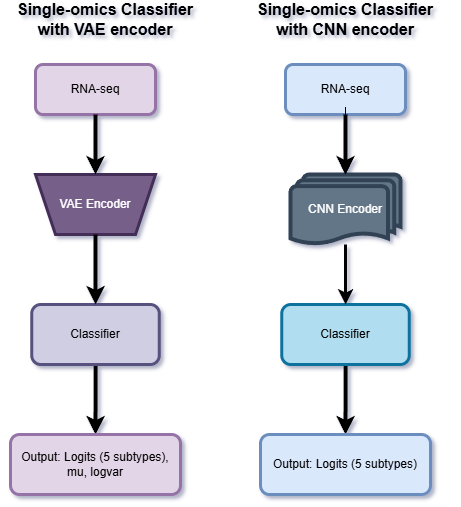

# Single-Omics Classifiers for Breast Cancer Subtype Prediction

This repository contains two simple RNA-seq-based deep learning classifiers designed for breast cancer subtype prediction. These models operate on transcriptomic features alone, offering efficient and interpretable baselines for evaluating subtype classification performance without the need for multimodal data.

<figure>
  
  <figcaption style="text-align:center; font-style:italic;">Single-modality Model Architecture</figcaption>
</figure>

---

## 📦 Overview

Breast cancer is a heterogeneous disease comprising several molecular subtypes. While multimodal data can improve predictive performance, transcriptomic data alone often carry significant signal for subtype segregation. These classifiers provide two distinct architectural approaches to modeling RNA-seq expression data:

- `SingleOmicsClassifier`: A **VAE-based** classifier
- `SingleOmicsClassifierCNN`: A **CNN-based** classifier

---
## 🧠 Model Architectures

### 🔹 `SingleOmicsClassifier` (VAE-Based)

This model uses a **Variational Autoencoder (VAE)** to encode high-dimensional RNA-seq data into a compact latent space before classification.

**🔧 Components:**

- **Encoder**: `VAEEncoder`
  - **Input dim**: `20,000(default)`
  - **Hidden layers**:
    - `Linear(20000 → 1024) → BatchNorm1d → LeakyReLU(0.2) → Dropout(0.2)`
    - `Linear(1024 → 512) → BatchNorm1d → LeakyReLU(0.2) → Dropout(0.2)`
  - **Latent mappings**:
    - `mu`: `Linear(512 → 64)`
    - `logvar`: `Linear(512 → 64)` → `softplus` → `clamp(min=1e-4, max=10.0)`
  - **Sampling**: Reparameterization trick with added epsilon stability

- **Normalization**: `LayerNorm(64)` applied to latent vector `z`
- **Classifier**:
  - `Linear(64 → 128) → ReLU → Dropout(0.3)`
  - `Linear(128 → 4)`

**🧾 Output:**

- `logits`: Class predictions for 5 subtypes
- `mu_rna`, `logvar_rna`: For computing KL divergence loss

---

### 🔹 `SingleOmicsClassifierCNN` (CNN-Based)

A convolutional alternative that uses a custom `RNACNNEncoder` to extract local structure and patterns from the RNA-seq input.

**🔧 Components:**

- **Encoder**: `RNACNNEncoder`
  - **Input dim**: `20,000(default)`
  - **Latent dim**: `64(default)`
  - **Layers**:
  - `Conv1d(1 → 64, kernel=11, stride=2, pad=5) → BatchNorm1d → GELU`
  - `Conv1d(64 → 128, kernel=5, stride=2, pad=2) → BatchNorm1d → GELU`
  - `Conv1d(128 → 256, kernel=5, stride=2, pad=2) → BatchNorm1d → GELU`
  - `Conv1d(256 → 512, kernel=53 stride=2, pad=21 → BatchNorm1d → GELU`
  - **Pooling**:
  - `AdaptiveAvgPool1d(1)`
  - ** Layer**:
  - `Flatten → Linear(512 → 64) → GELU → Dropout(0.4)`
- **Normalization**: `LayerNorm` on encoded output
- **Classifier**:
  - `Linear(64 → 256) → GELU → Dropout(0.3)`
  - `Linear(256 → 128) → GELU → Dropout(0.3)`
  - `Linear(128 → 4)`

**🧾 Output:**

- `logits`: Class predictions for 5 subtypes

---

## 🏋️ Training
The training module runs in an optimized fashion where to address class balance a choice is provided to the user to either use Focal Loss or Cross-Entropy Loss.
- **Hyperparameters:**
  - Latent dimension, β for KL loss, γ for focal loss
  - Label smoothing and class weighting
  - Learning rate, weight decay

---
